README

**Objetivo:** Este tutorial ensina como criar um pipeline de busca (ou pesquisa) alimentado por IA usando o Azure AI Search e serviços relacionados. O objetivo é permitir que você pesquise e extraia facilmente insights de uma coleção de documentos de avaliações de clientes.

**Etapas Principais**

1. **Provisionar Recursos do Azure:**
   * Criar um recurso Azure AI Search para indexação e consulta.
   * Configurar um recurso Azure AI Services para fornecer análise de texto, análise de sentimento e outras melhorias de IA.
   * Criar uma conta de armazenamento do Azure para armazenar seus documentos de feedback dos clientes.

2. **Carregar documentos:**
    * Faça o download de um conjunto de exemplos de avaliações de café e carregue os arquivos no container do Azure Storage que você criou.

3. **Indexe seus dados:**
   * Use o assistente 'Importar dados' do portal do Azure para:
     * Conectar-se ao container do Azure Storage com os comentários dos clientes.
     * Definir um conjunto de habilidades com habilidades cognitivas (OCR, extração de frases-chave, análise de sentimento, marcação de imagens, legendagem de imagens)
     * Criar um índice de destino para armazenar dados processados e pesquisáveis
     * Configurar um Indexador para automatizar o processo

4. **Consultar o índice:**
    * Use o Search Explorer dentro do portal do Azure para testar consultas em seu índice.
    * Comece com pesquisas simples, depois experimente filtros para localização e análise de sentimentos.

5. **Explore o Knowledge Store:**
    * Visualize os dados enriquecidos gerados e salvos pelo AI Skills.
    * Examine as projeções, que são novos documentos criados com os insights gerados pela IA.
    * Veja entidades extraídas, como frases-chave, armazenadas em tabelas para análise.

**Por que isso é importante?**

Esse tipo de solução de pesquisa alimentada por IA pode transformar dados não estruturados (como comentários de clientes) em conhecimento valioso. As empresas podem então:

* Encontrar facilmente informações específicas enterradas em um grande número de documentos.
* Descobrir padrões no feedback dos clientes.
* Melhorar produtos e serviços com base nos insights obtidos.

passos:

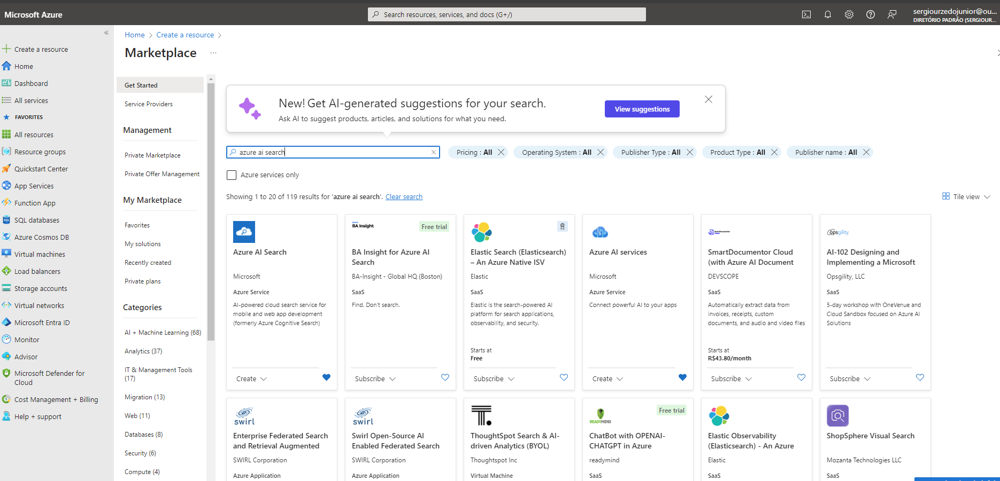
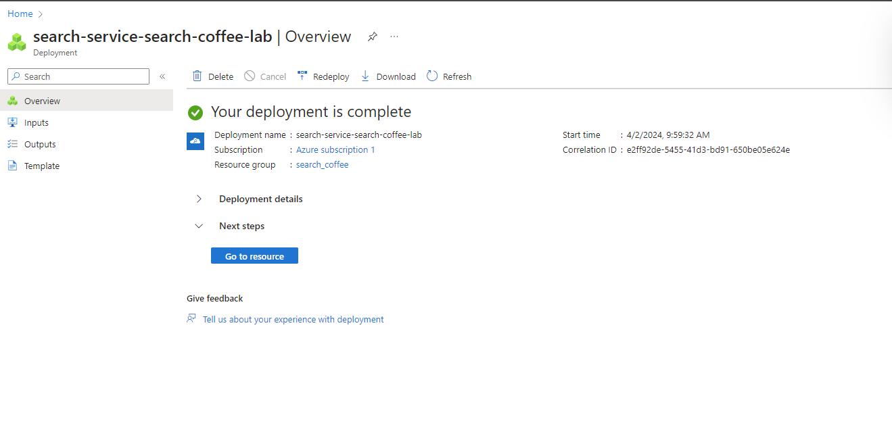
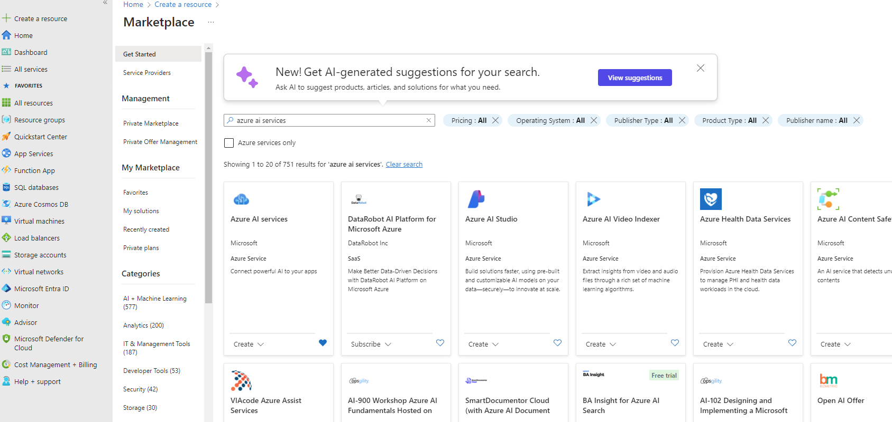
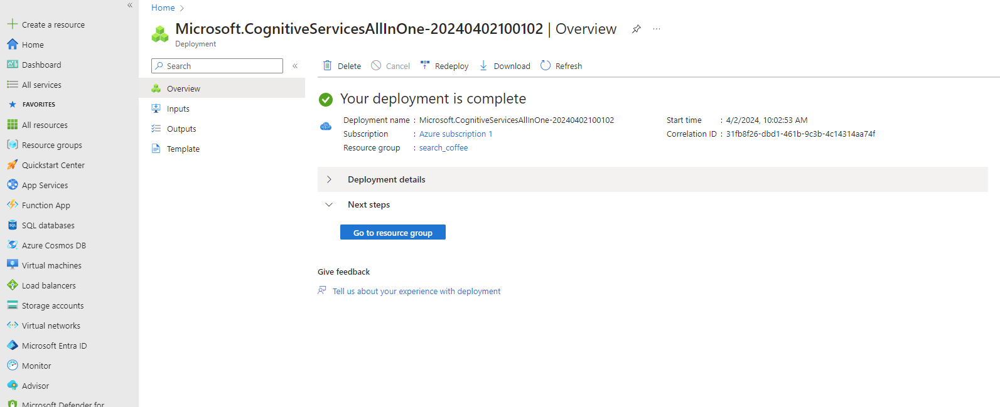
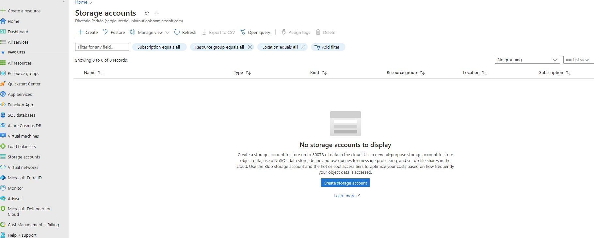
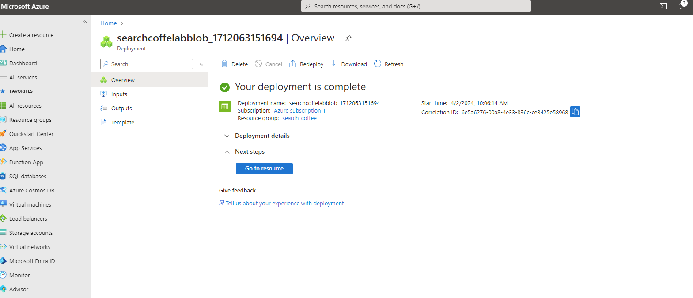
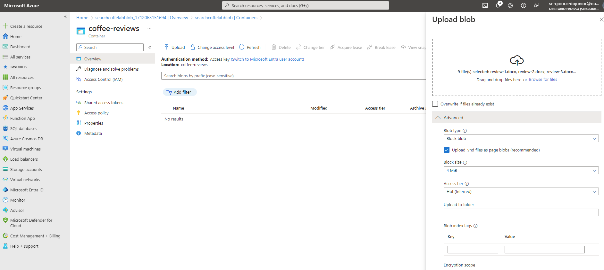
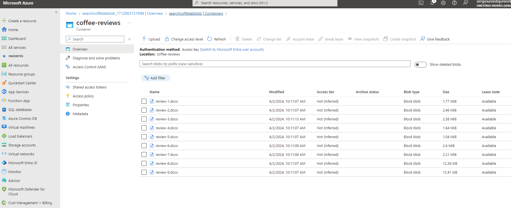
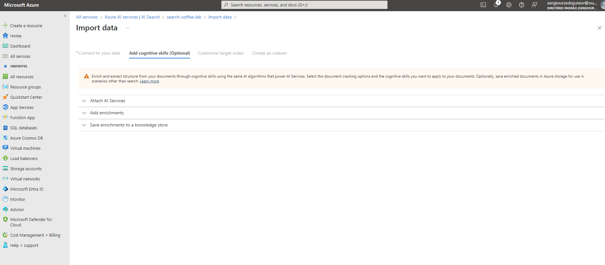
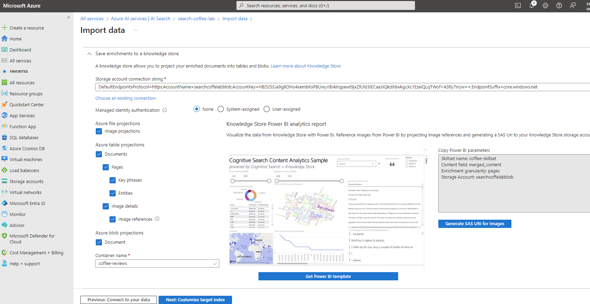
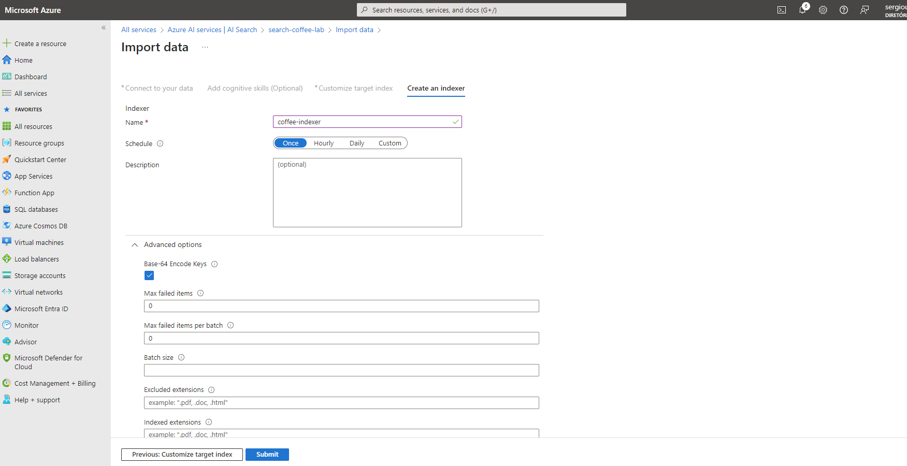
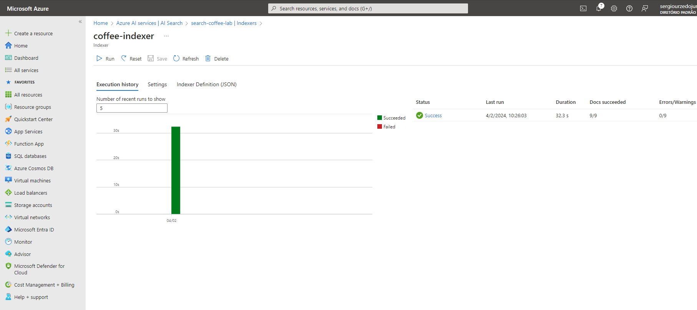
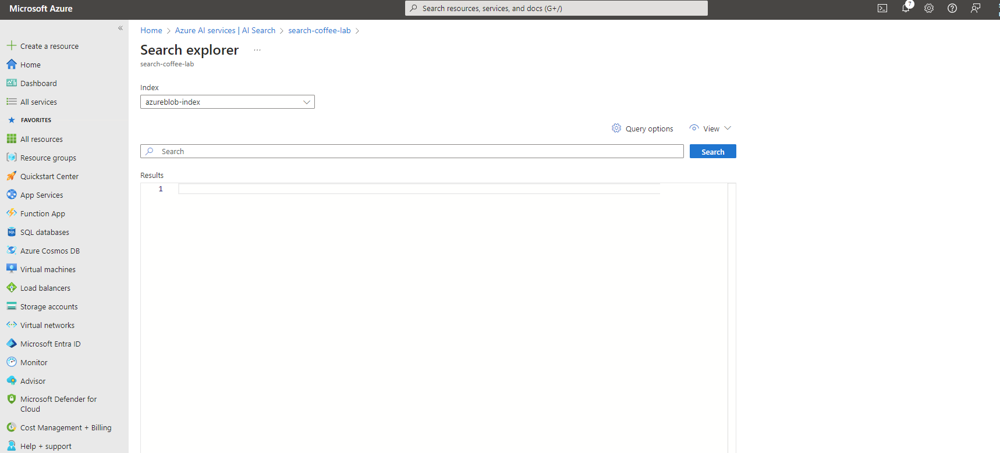
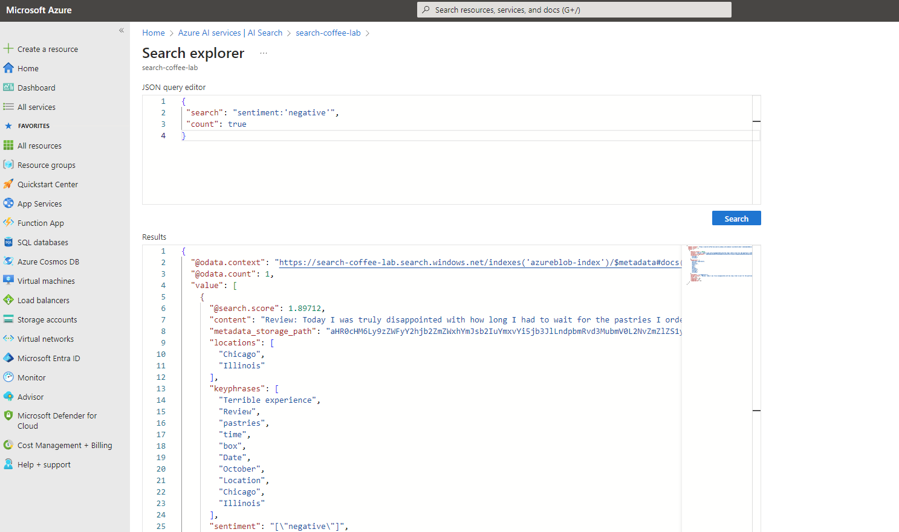
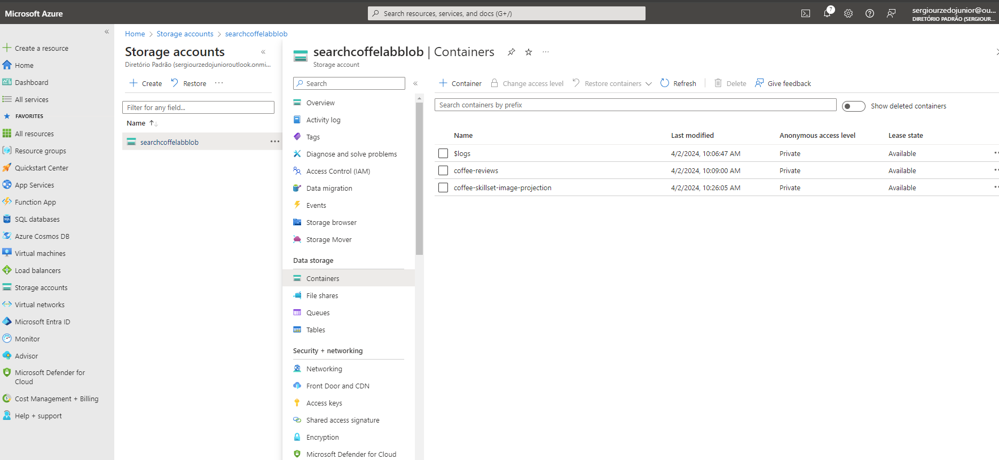

